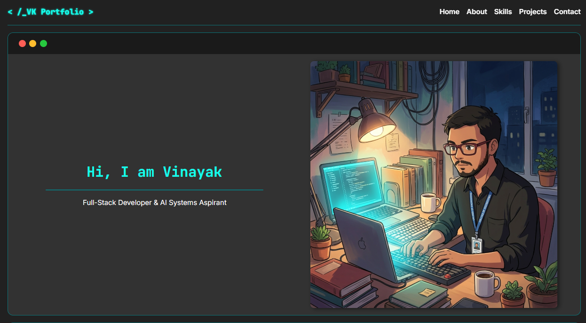
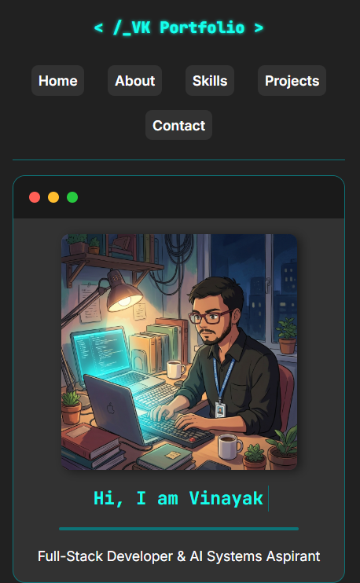
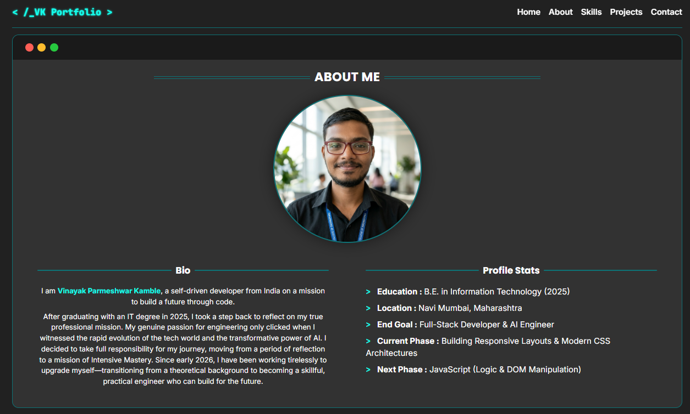
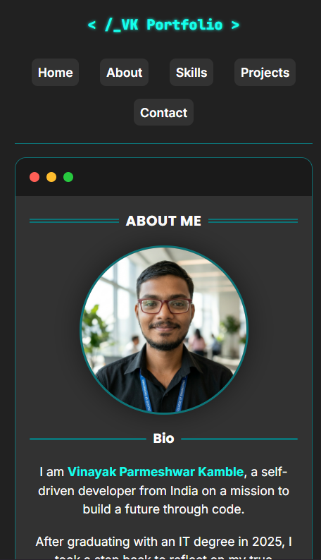
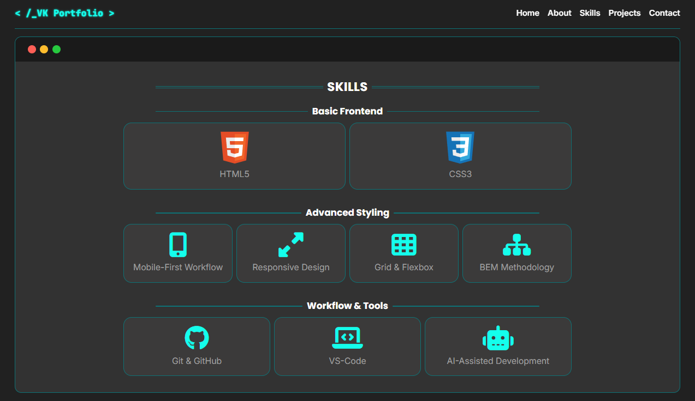
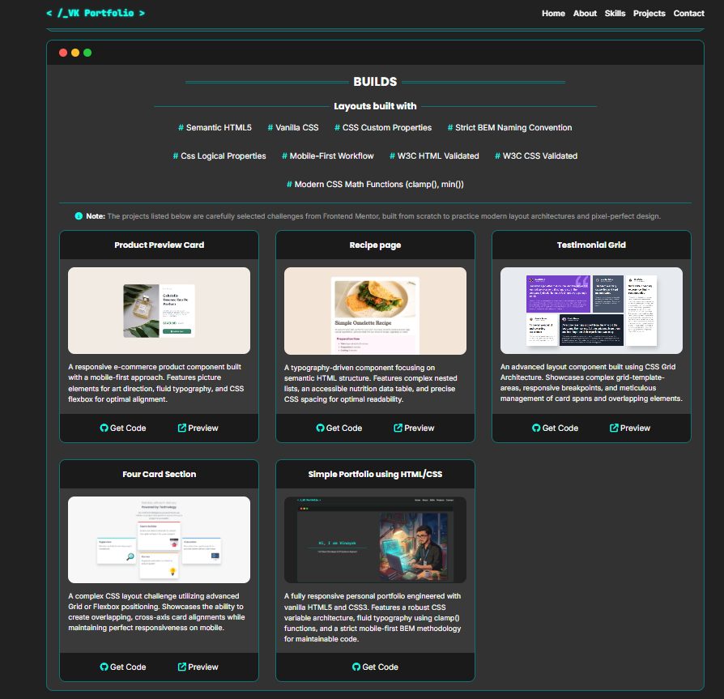
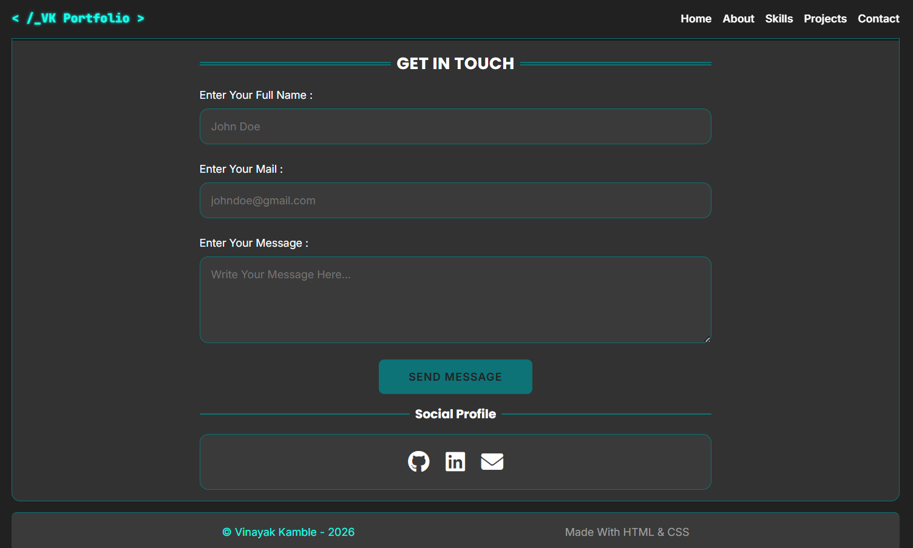

# Developer Portfolio v2

A custom-engineered, fully responsive terminal-inspired personal portfolio designed to showcase front-end engineering discipline and continuous learning.

## Previews

### 🖥️ Hero Section
| Desktop View | Mobile View |
| :---: | :---: |
|  |  |

### 👤 About Section
| Desktop View | Mobile View |
| :---: | :---: |
|  |  |

### 🛠️ Skills & Projects
| Skills Section | Projects Section |
| :---: | :---: |
|  |  |

### 📬 Contact & Footer


## Key Features

- **Terminal-Inspired UI:** Sleek, dark-mode terminal window aesthetic with custom-colored window control indicators.

- **Fluid Layout System:** Fully fluid typography and spacing that adapt seamlessly from 320px mobile screens to large desktop viewports.

- **Dynamic Build Cards:** Interactive project articles with clean image zoom hover effects and custom click (`:active`) feedback.

- **Accessible Contact Area:** A fully formatted contact form with structured input groups, custom focus states, and vertical-only textarea resizing.

- **Interactive Social Panel:** A centered social link list featuring custom SVG envelope hover animations.

- **Accessibility Engine:** Integrated accessibility defaults including responsive motion-reduction controls (`prefers-reduced-motion: reduce`).

## File Architecture

```text
├── images/             # Project screenshots and assets
├── index.html          # Semantic HTML5 entry page
├── README.md           # Documentation
└── style.css           # Modular stylesheet (950+ lines of responsive CSS)
```

## Built With

- Semantic HTML5 markup
- Vanilla CSS3
- Custom CSS Variables (for centralized theme coloring and spacing tokens)
- Strict BEM Naming Convention (for a highly maintainable, component-based stylesheet architecture)
- CSS Grid & Flexbox (Hybrid responsive layout system)
- Fluid Typography & Spacing via CSS `clamp()` math functions
- Mobile-First responsive workflow
- W3C Validated HTML & CSS

## What I Learned

- **Fluid Typography & System Design:** I mastered the use of CSS variables combined with `clamp()` math functions to build a type-scaling system that dynamically resizes text, image boxes, and icons across different screens without needing dozens of redundant media queries.

- **Component-Driven CSS with BEM:** I moved from writing unstructured style blocks to component-based, flat CSS using the BEM (Block, Element, Modifier) methodology. This keeps classes self-contained and avoids specificity conflicts.

- **Dynamic Interactive States:** I developed professional hover and active (`:active`) states for card buttons and social icons. By grouping CSS transitions and using structural visibility swapping, I made components like the mail link interactive on both desktop clicks and mobile touch taps.

- **Accessibility & CSS Resets:** 
  - Standardized form accessibility by mapping `<label>` tags to their respective inputs using `for` and `id`.
  - Added modern reset rules like `resize: vertical` on textareas to protect layouts from horizontal overflow.
  - Implemented the `prefers-reduced-motion` media query to automatically disable animations for users with vestibular/motion sensitivities, conforming to WCAG standards.

## How to Run Locally

1. Clone this repository to your local machine:
   ```bash
   git clone https://github.com/CodeWithVinayakKamble/vinayak-portfolio-v2.git
   ```
2. Open the project folder in VS Code.
3. Right-click `index.html` and select **Open with Live Server**.

## Credits & Resources

- **Fonts:** [Google Fonts](https://fonts.google.com/) (Inter, Poppins, JetBrains Mono)

- **Colors:** [Color Hunt](https://colorhunt.co/) (for the color palette)

- **Icons:** [Font Awesome v6](https://fontawesome.com/) & [Devicon](https://devicon.dev/) (for SVG language and technology badges)

- **AI Asset Generation:** Mockups and image assets generated using **Gemini** (powered by Google DeepMind)

- **Tutor Support:** Engineered with coding guidance and tutoring from **Antigravity** (AI Coding Tutor powered by Gemini/Google DeepMind)

- **Project Authenticity:** Built from scratch using standard design guidelines, responsive styling rules, and documentation—
**not copy-pasted** from pre-made templates or from any ai.

## Author

- Coded by **Vinayak Kamble**
- GitHub: [CodeWithVinayakKamble](https://github.com/CodeWithVinayakKamble)
- LinkedIn: [Vinayak Kamble](https://www.linkedin.com/in/vinayak-kamble-105171262/)
